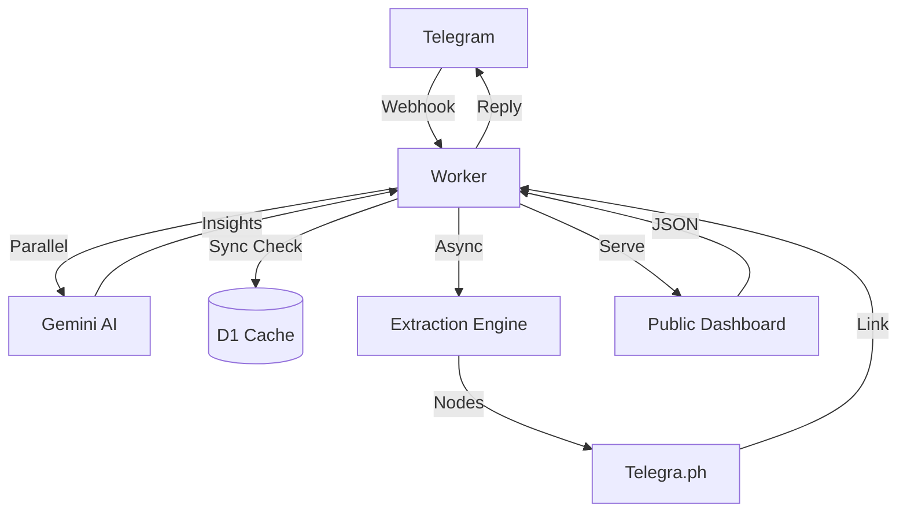

## 1. System Overview
LinxtexBot follows the **Hickey Mode** architecture: **Simple Made Easy**. It de-complects time (ingestion vs processing) and treats the internet as a **Database of Immutable Facts**.

### 1.1 Core Principles
- **De-complecting Time**: Webhooks are ingested instantly; processing happens in a background log/context.
- **The Value of Values**: URLs are immutable keys. Processing a URL once creates a permanent "Fact".
- **Dual-Persistence Persistence Strategy**:
    - **KV (Key-Value) - The View Layer**: Stores final, immutable projections: `SHA256(URL) -> JSON { ivLink, insight }`. Optimized for Godmode speed (<10ms).
    - **D1 (SQLite) - The System of Record**: Stores "Events" and relational data (history, trends, dashboard signals).
- **Projections**: The dashboard is a projection of the fact database, served via a high-velocity cache.

## 2. Component Diagram

## 3. Modules
- `src/index.ts`: Entry point, API routes, and update handler.
- `src/domain.ts`: Core transducers and schema definitions.
- `src/parser.ts`: Article extraction and sanitization.
- `src/gemini.ts`: Epistemic synthesis (Macro/Finance).
- `src/twitter.ts`: Twitter API and redirect resolution.
- `src/projections.ts`: Formatting and stats delivery.
- `public/index.html`: Aggregator dashboard frontend.

## 4. Development & Testing
- **Runtime**: Native **Bun**. No Node.js dependencies in production.
- **Testing**: High-fidelity local testing via `bun test` using a `bun:sqlite` in-memory shim for D1.
- **Protocol**: Autonomous monitoring via **Ralph-Nano** (Godmode).
