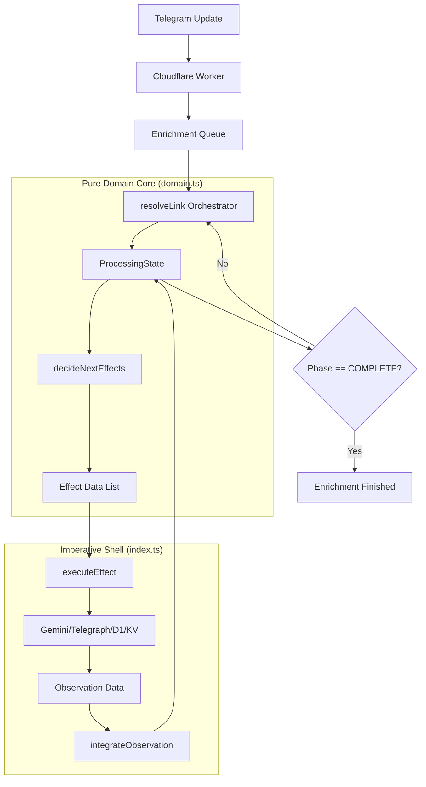

# LinxtexBot Architecture: De-complectated Enrichment

This document describes the high-reliability orchestration engine powering LinxtexBot.

## 1. The Core Loop (Hickey Mode)

The system follows a pure functional core / imperative shell pattern.

## 2. State Phases

1.  **RESOLVING**: Unwrapping redirects and identifying the primary source URL.
2.  **ENRICHING**: Fetching content and performing initial AI synthesis (General/Financial).
3.  **VERIFYING**: Running the "Critic" tier to audit AI assertions against source content.
4.  **PERSISTING**: Committing facts to D1 (Relational) and KV (View Cache).
5.  **COMPLETE**: Terminal state.

## 3. Epistemic Integrity

The `Critic` tier ensures that every insight published to the "View Layer" is grounded in the source text. If a hallucination is detected, the system transitions back to `HEALING` to refine the output before persistence.

## 4. Testability

By decoupling the `Executor` from the `Orchestrator`, we achieve 100% test coverage using an in-memory "Digital Twin" of the infrastructure.
