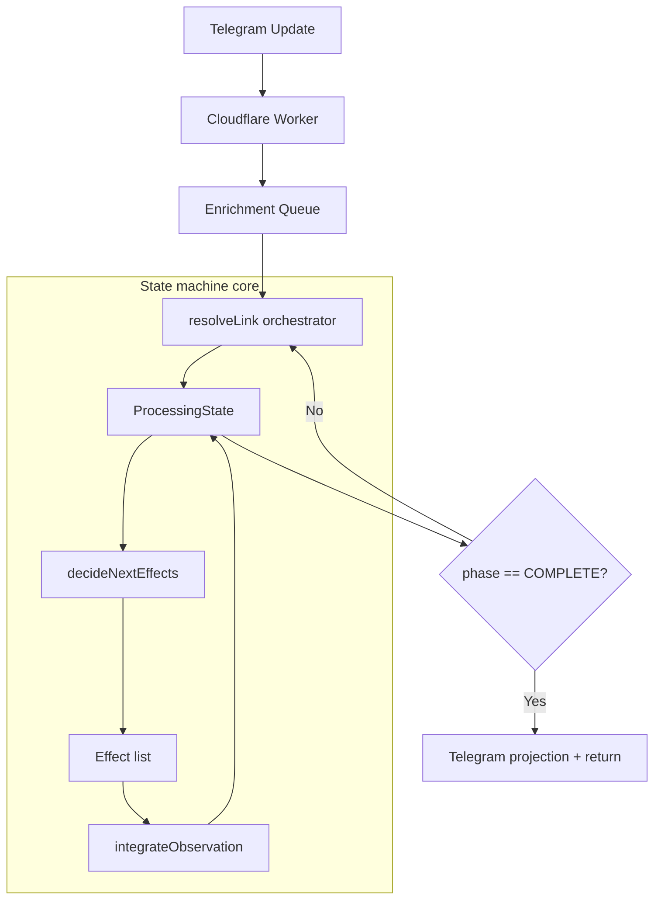

# LinxtexBot Architecture: De-complectated Enrichment

This document describes the current orchestration engine that powers LinxtexBot as it exists in the codebase today.

## Database schema and migrations

D1 schema evolution now lives in `migrations/`.

- Apply local migrations with `wrangler d1 migrations apply iv-cache --local`
- Apply remote migrations with `wrangler d1 migrations apply iv-cache --remote`
- `schema.sql` is only a snapshot/bootstrap convenience file now

See `docs/database.md` for the current baseline tables and migration workflow.

## 1. Runtime shape

Linxtex follows a **functional-core / imperative-shell** split:

- **Pure-ish state machine** in `src/domain.ts` and `src/state.ts`
  - `decideNextEffects(state)` derives the next effect list from the current `ProcessingState`
  - `integrateObservation(state, observation)` folds effect results back into state
- **Imperative shell** in `src/orchestrator.ts`
  - `resolveLink()` runs the state loop and delegates final Telegram projection once the machine reaches `COMPLETE`
- **Effect interpreter** in `src/executor.ts`
  - fetches content, calls Gemini, publishes Telegraph pages, writes D1/KV, and sends Telegram API calls
- **Ingress / transport** in `src/index.ts` and `src/handlers.ts`
  - webhook handling, queue consumption, scheduled cleanup, and reprocess operations
- **Projection / routing helpers** in `src/telegram_projection.ts` and `src/perspective.ts`
  - final Telegram output selection, suppression, per-chat perspective lookup, and tone-template selection

## 2. Implemented phases

These are the **actual** `MachinePhase` values in `src/types.ts`:

1. **RESOLVING**
   - initial state for a URL
   - performs cache lookup / fetch kickoff logic through the decider
2. **ENRICHING**
   - content has been fetched
   - generates either financial insight, general summary, or extractive fallback
3. **VERIFYING**
   - runs the critic/verification pass for financial insight
4. **HEALING**
   - if the critic marks an insight as hallucinated or low quality, the state is reset with healing hints and enrichment restarts
5. **PERSISTING**
   - stores relational state, trace logs, dedup/cache state, and final view cache
6. **COMPLETE**
   - terminal state

There is **no separate `PROJECTING` phase** in the current implementation. Projection is a shell concern performed **after** the state loop.

## 3. Telegram projection behavior

Final Telegram projection is handled in `src/telegram_projection.ts` once the machine exits the loop.

### Delivery modes

- **Single-message flow**: edits the source Telegram message with `EDIT_TELEGRAM_MESSAGE`
- **Multi-post flow**: sends a new Telegram message with `SEND_TELEGRAM`

### Suppression gates

Projection suppresses output when:

- extracted content is under the low-content threshold (`< 100` chars)
- `relevanceScore < 40`

Those suppression decisions are also persisted to `events` for traceability.

### Output selection

The projection layer chooses among these output shapes:

- **Compact inline output**
  - title + summary + original source link
  - used for lower-confidence-but-allowed items or compact tone templates
- **Direct content output**
  - title + summary + article text when content is short enough to avoid Telegraph
- **Title-masked Telegraph link**
  - used when `ivLink` exists for longer content
- **Fallback original link**
  - used when Telegraph publication is unavailable

### Tone-template behavior

Tone templates can alter presentation by controlling:

- emoji usage in title decoration
- verbosity (`compact`, `standard`, `verbose`)
- fact-check visibility in verbose paths

## 4. Perspective routing

`src/perspective.ts` provides per-chat routing hooks for both synthesis and presentation.

Lookup candidates are checked in this order:

1. `@username`
2. bare `username`
3. numeric `chat.id`
4. `chat.title`

Matched rules can provide:

- a **perspective** string for Gemini prompt augmentation
- a **tone template** for Telegram projection

The routing surface exists now even if the actual channel map is still mostly scaffold/config-driven.

## 5. Quality and integrity gates

The current runtime enforces several gates:

- **Low-content suppression** in `src/telegram_projection.ts` for extracted content under 100 characters
- **Low-conviction suppression** in `src/telegram_projection.ts` for `relevanceScore < 40`
- **Critic verification** in `src/state.ts`
  - bad verdicts transition to `HEALING`
  - successful or unparseable verdicts continue to `PERSISTING`
- **Deduplication/content hash reuse** through `CHECK_CONTENT_HASH`, `content_hashes`, and `insight_logs`
- **Previous insight lookup** from `urls.insight` to support diff-aware regeneration
- **Dynamic parsing rules** from `logic_rules` (with KV caching when available)

## 6. Persistence model

The runtime currently treats D1 as:

- **`urls`**: flattened current record for a URL (`url`, `title`, `iv_link`, `insight`, `trace_id`, `last_enriched`, `created_at`)
- **`insight_logs`**: append-only forensic trace of generated insights and metadata
- **`content_hashes`**: deduplication store for already-seen content
- **`events`**: operational telemetry and recovery log
- **`logic_rules`**: programmable parsing rules loaded into KV cache when present

Scheduled cleanup currently prunes:

- `content_hashes`
- `insight_logs`
- `events`

## 7. Module responsibilities

| Module | Current responsibility |
|---|---|
| `src/index.ts` | Worker fetch/queue/scheduled entrypoints and lightweight API routes |
| `src/handlers.ts` | Telegram update ingestion, telemetry, filtering, queue enqueue, and reprocess logic |
| `src/orchestrator.ts` | Main state loop and orchestration glue |
| `src/domain.ts` | Decider logic, transforms, schemas, and domain helpers |
| `src/state.ts` | Observation integration and phase transitions |
| `src/executor.ts` | External side effects, persistence, Gemini calls, and parsing-rule loading |
| `src/parser.ts` | Content extraction |
| `src/telegraph.ts` | Telegraph publishing |
| `src/url_utils.ts` | URL extraction/filtering utilities |
| `src/telegram_projection.ts` | Output formatting, suppression, and Telegram delivery selection |
| `src/perspective.ts` | Chat-to-perspective and tone-template routing |

## 8. Formerly suspicious modules

These modules are **not orphaned right now**; they still have an active role or test coverage:

- `src/projections.ts` — reusable message formatting helpers, covered by `test/projections.spec.ts`
- `src/twitter.ts` — X/Twitter URL and thread handling utilities, covered by `test/twitter.spec.ts`
- `src/middleware.ts` — request utility behavior, covered by `test/middleware.spec.ts`
- `src/logger.ts` — small logging abstraction available to callers

They may still deserve refactoring or better integration, but calling them dead code would be inaccurate.

## 9. Testability

The architecture is easy to exercise because:

- the orchestrator accepts an injected executor
- the state machine is driven by plain data (`ProcessingState`, `Observation`, `Effect`)
- end-to-end behavior is covered by lifecycle, smoke, and route tests under `test/`

That separation is the good part. Keep that. Don’t re-complect it.
