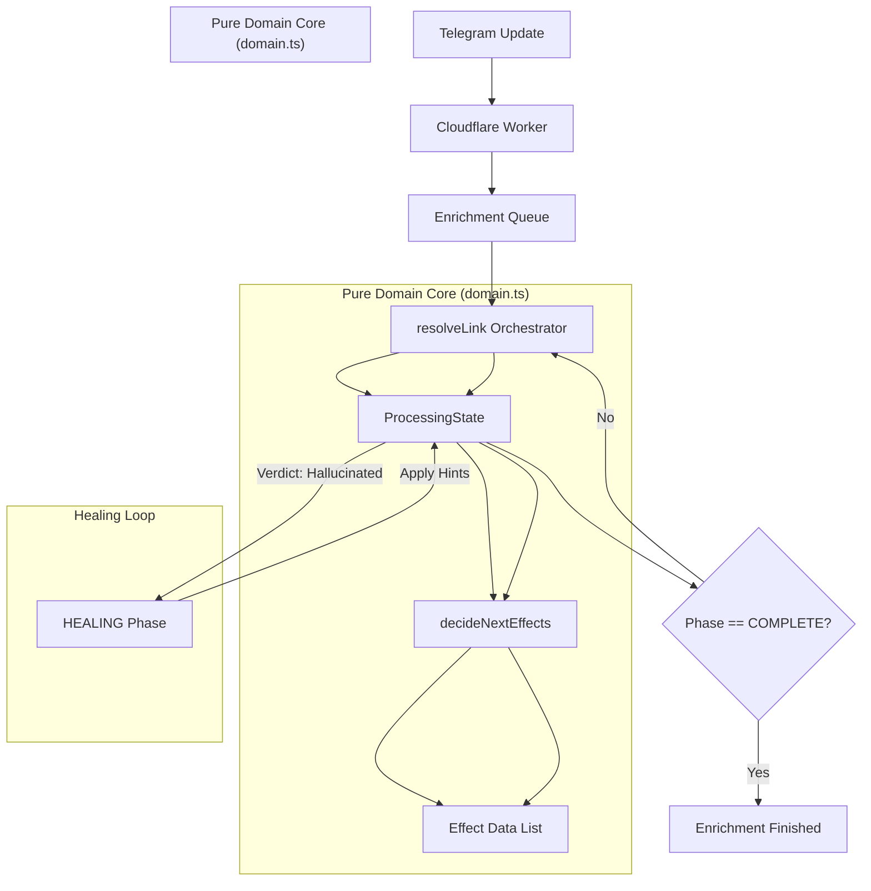

# LinxtexBot Architecture: De-complectated Enrichment

This document describes the high-reliability orchestration engine powering LinxtexBot.

## 1. The Core Loop (Hickey Mode)

The system follows a pure functional core / imperative shell pattern.

## 2. State Phases

1.  **RESOLVING**: Unwrapping redirects and identifying the primary source URL.
2.  **ENRICHING**: Fetching content and performing initial AI synthesis (General/Financial).
3.  **VERIFYING**: Running the "Critic" tier to audit AI assertions against source content.
4.  **HEALING**: Formulating corrections based on Critic feedback before retrying synthesis.
5.  **PERSISTING**: Committing facts to D1 (Relational) and KV (View Cache).
6.  **PROJECTING**: Converting processed article data into Telegram-compatible messages (In-place Edit vs Isolated Broadcast).
7.  **COMPLETE**: Terminal state.

## 3. Adaptive Projection Layer

The shell (`resolveLink`) dynamically chooses the most frictionless delivery format:

-   **Standard Case (1-3 links)**: Performs an `editMessageText` on the source, replacing the URL with a title-masked hyperlink to the mirror.
-   **Isolated Case (> 3 links)**: Decomposes the message into $N$ unique signals, each enqueued as a standalone event with its own trace ID.
-   **Content Threshold (4000 Chars)**:
    -   If the article is short, it bypasses Telegra.ph and posts the **Insight + Full Content** directly.
    -   If the article is long, it mirrors to a Telegra.ph Instant View page for optimal reading.

## 4. Signal Quality Gates

-   **Universal Blogpost Filter**: Heuristically prioritizes research papers and deep-dive blogs over social homepages and referral noise.
-   **Low-Content Suppression**: Automatically discards signals with $< 100$ characters of meaningful content to protect the feed from junk/blockers.

## 5. Epistemic Integrity

The `Critic` tier ensures that every insight published to the "View Layer" is grounded in the source text. If a hallucination is detected, the system transitions back to `HEALING` to refine the output before persistence.

## 6. Testability

By decoupling the `Executor` from the `Orchestrator`, we achieve 100% test coverage using an in-memory "Digital Twin" of the infrastructure.
