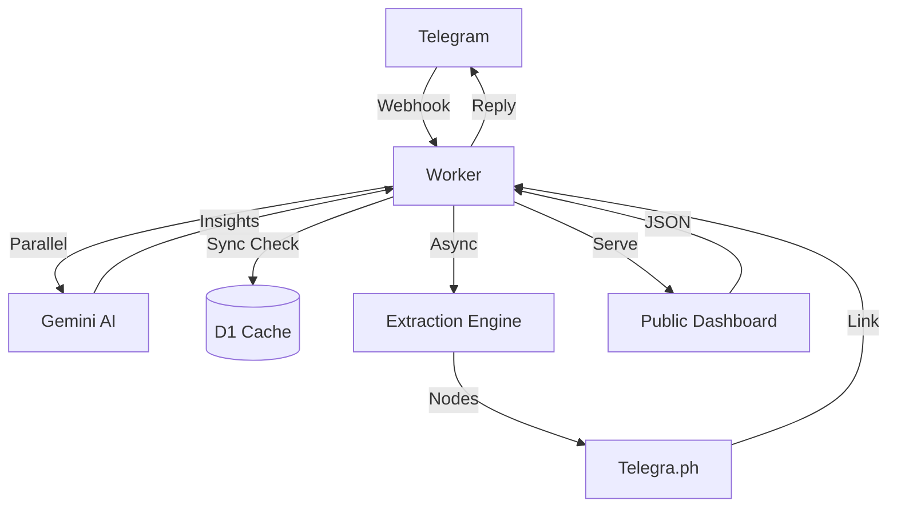

# Architecture Document - LinxtexBot

## 1. System Overview
LinxtexBot is a **Bun-native** Cloudflare application that processes Telegram link updates via webhooks.

## 2. Component Diagram

## 3. Modules
- `src/index.ts`: Entry point, API routes, and update handler.
- `src/domain.ts`: Core transducers and schema definitions.
- `src/parser.ts`: Article extraction and sanitization.
- `src/gemini.ts`: Epistemic synthesis (Macro/Finance).
- `src/twitter.ts`: Twitter API and redirect resolution.
- `src/projections.ts`: Formatting and stats delivery.
- `public/index.html`: Aggregator dashboard frontend.
